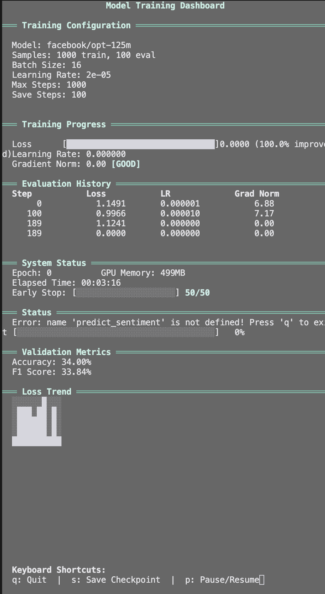

# Training Dashboard User Guide

## Overview
The Training Dashboard is an interactive terminal interface for monitoring and controlling your model training process in real-time.

## Display Sections
1. **Training Configuration** - Shows model setup and parameters
2. **Training Progress** - Real-time metrics including:
   - Loss speedometer
   - Learning rate
   - Gradient norm with color-coded status
3. **Evaluation History** - Table of recent metrics
4. **System Status** - Runtime information and early stopping progress
5. **Validation Metrics** - Accuracy and F1 scores with trend plots
6. **Inference Results** - Test predictions with confidence scores

Reference: 
```63:90:modules/dashboard.py
    def _draw_dashboard(self):
        self.stdscr.clear()
        config_items = [
        # Main title
        title = "Model Training Dashboard"
        self.stdscr.addstr(0, (self.max_x - len(title)) // 2, title, curses.A_BOLD | curses.color_pair(4))
            f"Learning Rate: {self.config.learning_rate}",
        # Training Configuration Section
        self._draw_section_header(2, 0, "Training Configuration")
        config_items = [
            f"Model: {self.config.model_name}",
            f"Samples: {self.config.num_train_samples} train, {self.config.num_eval_samples} eval",
            f"Batch Size: {self.config.batch_size}",
            f"Learning Rate: {self.config.learning_rate}",
            f"Max Steps: {self.config.max_steps}",
            f"Save Steps: {self.config.save_steps}"
        ]
        for i, item in enumerate(config_items):
            self.stdscr.addstr(4 + i, 2, item)
            self._draw_section_header(current_y, 0, "Training Progress")
        current_y = 4 + len(config_items) + 2  # Start next section after config
            self._draw_speedometer(current_y, 2, current_metrics.get('loss', 0), 2.0, "Loss")
        if self.metrics_history:
            current_metrics = self.metrics_history[-1]
            current_y += 1
            # Training Progress Section
            self._draw_section_header(current_y, 0, "Training Progress")
            current_y += 2
```


## Color Coding
- 🟢 Green: Good/optimal values
- 🟡 Yellow: Warning/attention needed
- 🟥 Red: Critical/potential issues
- 🔵 Cyan: Headers and titles

Reference: 
```22:27:modules/dashboard.py
    def setup_colors(self):
        curses.start_color()
        curses.init_pair(1, curses.COLOR_GREEN, curses.COLOR_BLACK)
        curses.init_pair(2, curses.COLOR_RED, curses.COLOR_BLACK)
        curses.init_pair(3, curses.COLOR_YELLOW, curses.COLOR_BLACK)
        curses.init_pair(4, curses.COLOR_CYAN, curses.COLOR_BLACK)
```


## Interactive Controls
### Keyboard Shortcuts
- `q`: Quit/exit the dashboard
- `s`: Save current model checkpoint
- `p`: Pause/Resume training

Reference: 
```292:295:modules/dashboard.py
    def _draw_keyboard_shortcuts(self, y: int, x: int):
        """Draw keyboard shortcuts section"""
        self.stdscr.addstr(y, x, "Keyboard Shortcuts:", curses.A_BOLD)
        self.stdscr.addstr(y + 1, x, "q: Quit  |  s: Save Checkpoint  |  p: Pause/Resume")
```


## Important Indicators
1. **Gradient Norm Status**:
   - "GOOD" (Green): < 1.0
   - "WARN" (Yellow): 1.0 - 5.0
   - "HIGH" (Red): 5.0 - 10.0
   - "ALERT" (Blinking Red): > 10.0

2. **Early Stopping Progress**:
   - Shows remaining patience before training stops
   - Color changes from green to red as patience depletes

Reference: 
```209:217:modules/dashboard.py
        bar = "█" * filled + "░" * (width - filled)
        hours = int(seconds // 3600)
        color = (curses.color_pair(1) if remaining > patience // 2
                else curses.color_pair(3) if remaining > patience // 4
                else curses.color_pair(2))
        
        self.stdscr.addstr(y, x, "Early Stop: ")
        self.stdscr.addstr(f"[{bar}] ")
        self.stdscr.addstr(f"{remaining}/{patience}", color | curses.A_BOLD)
```


## Tips
1. Monitor the gradient norm gauge - if consistently "HIGH" or "ALERT", consider reducing the learning rate
2. Use the ASCII loss trend plot to spot training instabilities
3. Save checkpoints regularly using 's' during long training sessions
4. Check inference results before exiting to verify model performance

## Exiting
1. Training will complete automatically or stop early if triggered
2. Review final metrics and inference results
3. Press 'q' to exit when ready
4. Final results are saved to `./logs/results.md

